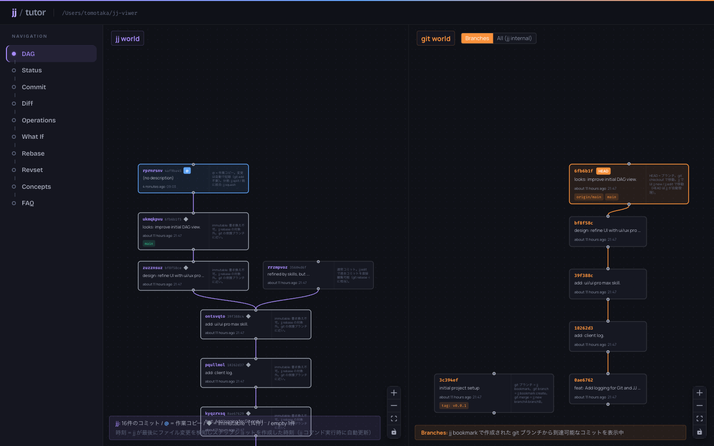
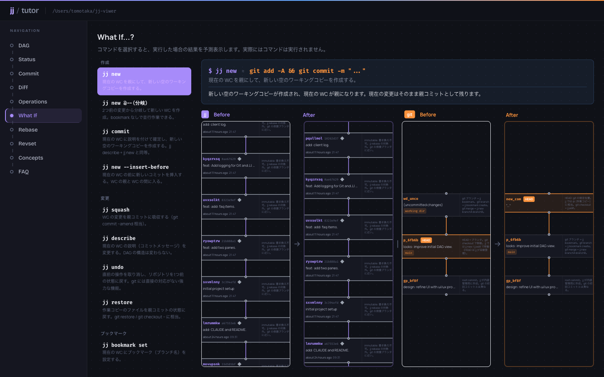
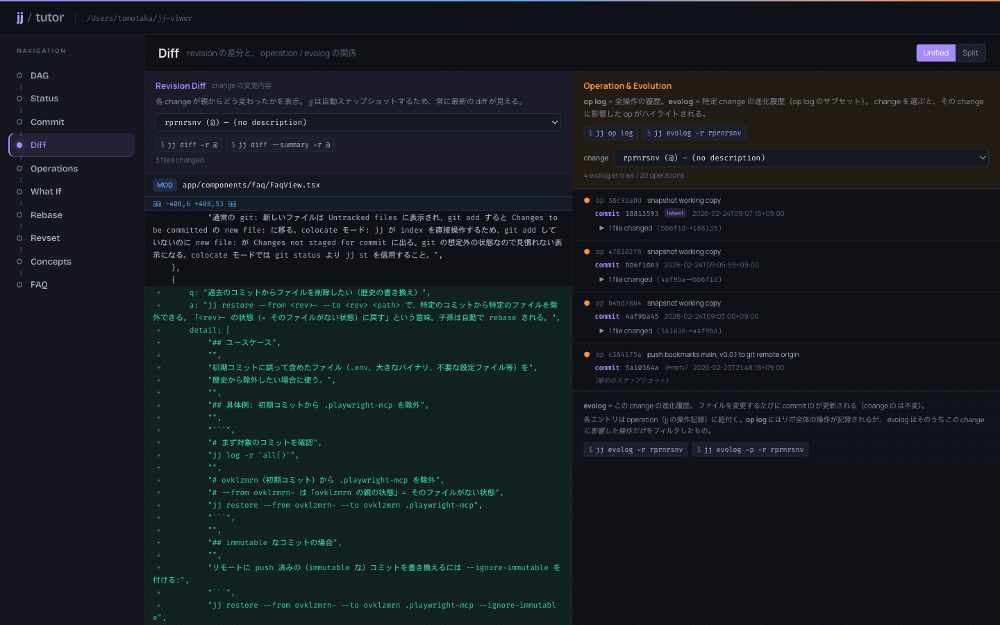
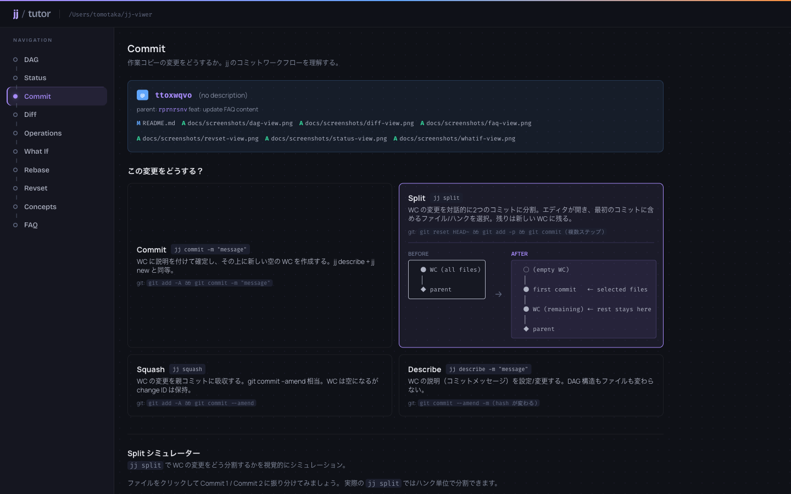
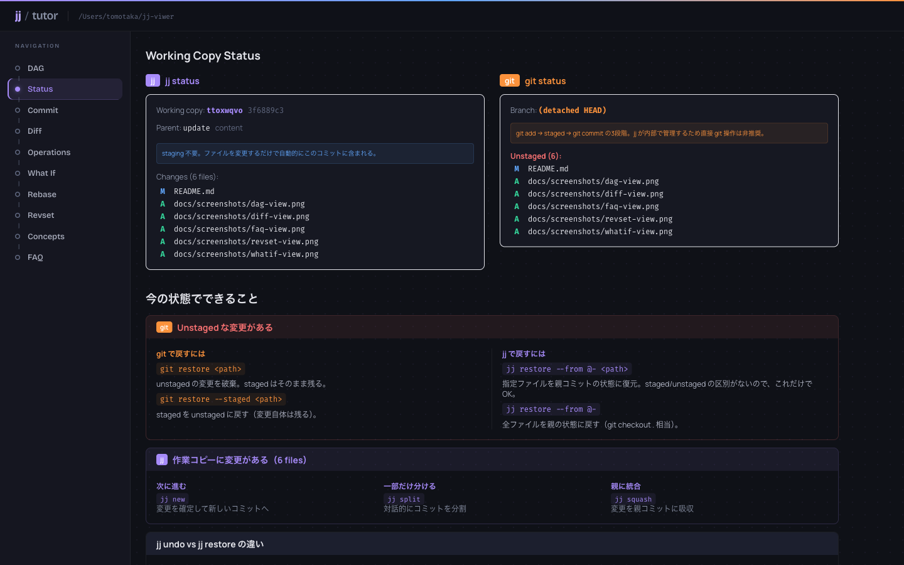
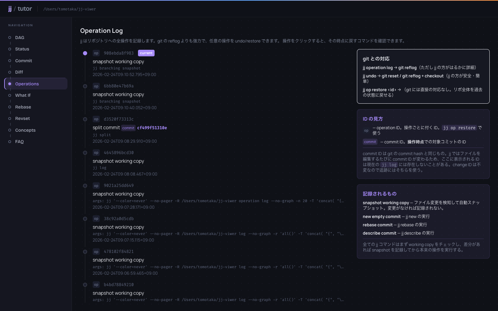
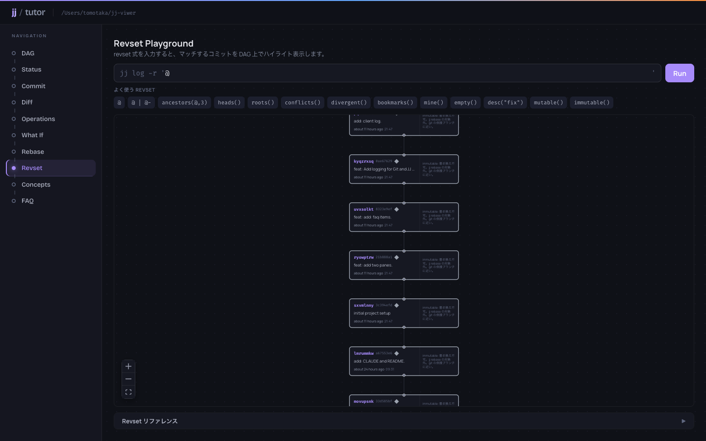
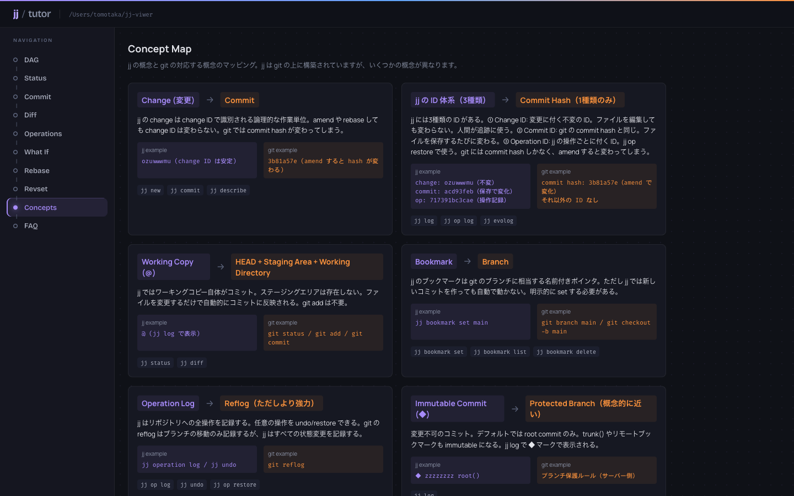
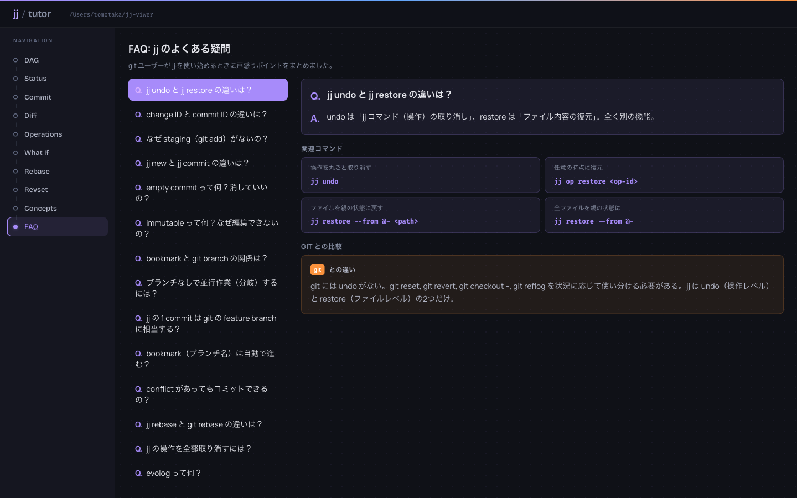

# jj tutor

Jujutsu (jj) VCS を対話的に学ぶための Web アプリケーション。実際のリポジトリをリアルタイムに可視化しながら、jj のコンセプトと操作を理解できます。

> **Note**: ローカル専用ツールです。ブラウザで表示しますが、Web サービスではありません。ローカルマシンで `pnpm run dev` を実行し、localhost にアクセスして使います。対象リポジトリの `jj` / `git` コマンドをサーバーサイドで実行して情報を取得します。



## Features

- **DAG 可視化** — jj と git のコミットグラフを並列表示（ReactFlow）

  

- **What If** — `jj new`, `jj commit`, `jj squash` 等を実行する前に結果を予測表示。git equivalent も併記

  

- **Diff** — Revision diff と Operation diff の2カラム表示。Unified / Split 切り替え対応

  

- **Commit ワークフロー** — commit / split / squash / describe の操作カードと Split シミュレーター

  

- **Status** — jj status と git status の並列比較

  

- **Operations** — jj の操作ログ表示

  

- **Revset Playground** — revset 式でコミットを検索・ハイライト

  

- **Concepts** — jj と git の概念マッピング（Change vs Commit、Bookmark vs Branch 等）

  

- **FAQ** — よくある質問と回答（git との比較付き）

  

## Requirements

- [mise](https://mise.jdx.dev/) (node, pnpm のバージョン管理)
- [jj](https://martinvonz.github.io/jj/) がインストール済みで PATH に通っていること
- git

## Setup

```bash
mise install
pnpm install
```

## Usage

対象リポジトリのディレクトリで起動:

```bash
cd /path/to/your-jj-repo
JJ_TUTOR_REPO_PATH=$(pwd) pnpm --prefix /path/to/jj-viwer run dev
```

または jj-tutor のディレクトリ内で起動すると、カレントディレクトリのリポジトリが対象になります:

```bash
pnpm run dev
```

ブラウザで http://localhost:5173 を開くと、3秒間隔でリポジトリの状態がリアルタイム更新されます。

## Tech Stack

- React Router v7 (SSR framework mode)
- React 19
- TypeScript
- Tailwind CSS v4
- ReactFlow + Dagre (DAG 可視化)
- Biome (lint / format)
